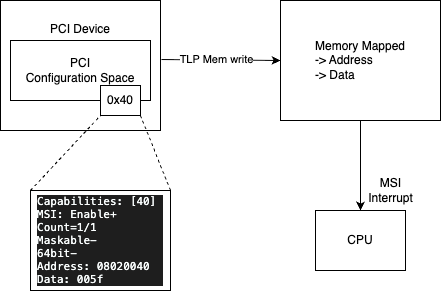
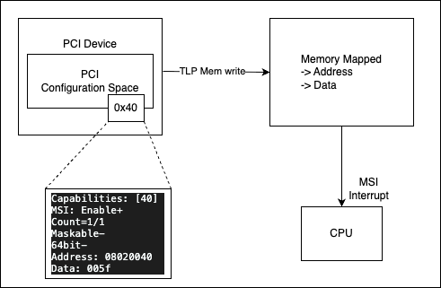

# 🚀 QEMU PCIe Device Development Repository

## 📚 Table of Contents

-   [📁 Repository Structure](#-repository-structure)
-   [🧰 Features Covered](#-features-covered)
-   [⚙️ What Happens When You Run
    QEMU](#️-what-happens-when-you-run-qemu)
-   [🛠️ Build Steps (Using Yocto
    Playground)](#️-build-steps-using-yocto-playground)
    -   [1️⃣ Build default Yocto image](#1️⃣-build-default-yocto-image)
    -   [2️⃣ Modify QEMU to add PCIe
        device](#2️⃣-modify-qemu-to-add-pcie-device)
    -   [3️⃣ Add Kconfig entry](#3️⃣-add-kconfig-entry)
    -   [4️⃣ Add Meson build entry](#4️⃣-add-meson-build-entry)
    -   [5️⃣ Commit changes](#5️⃣-commit-changes)
    -   [6️⃣ Finish devtool
        modifications](#6️⃣-finish-devtool-modifications)
    -   [7️⃣ Build final image](#7️⃣-build-final-image)
    -   [▶️ Launch QEMU](#️-launch-qemu)
-   [🔰 01-basic Demo](#-01-basic-Demo)
    -   [🔍 Basic lspci output](#-Basic-lspci-output)
    -   [📝 Basic dmesg output](#-Basic-dmesg-output)
-   [🔰 02-mmio Demo](#-02-mmio-Demo)
    -   [🔍 MMIO lspci output](#-MMIO-lspci-output)
    -   [📝 MMIO dmesg output](#-MMIO-dmesg-output)
    -   [🔢 Memory Read/Write](#-Memory-Read/Write)
    -   [📦 MMIO Region Layout](#-MMIO-Region-Layout)
    -   [🔄 Read–Write Flow](#-Read–Write-Flow)
-   [🔰 03-msi-x Demo](#-03-msi-x-Demo)
    -   [🧠 Understand MSI](#-Understand-MSI)
    -   [🔍 MSI lspci output](#-MSI-lspci-output)
    -   [📝 MSI dmesg output](#-MSI-dmesg-output)
    -   [⚡ MSI cat /proc/interrupts](#-MSI-cat-proc-interrupts)
    -   [🧠 Understand MSI-X](#-Understand-MSI-X)
    -   [🔍 MSI-X lspci output](#-MSI-X-lspci-output)
    -   [📝 MSI-X dmesg output](#-MSI-X-dmesg-output)
    -   [⚡ cat /proc/interrupts](#-cat-proc-interrupts)

This repository provides a complete learning path for creating **basic to advanced PCIe devices in QEMU**, along with corresponding **Linux drivers**.  
It is structured so you can explore progressively—from simplest PCI BAR examples to full-featured MSI/MSI-X, DMA engines, and custom capabilities.

## 📁 Repository Structure

    devices/
    ├── 01-basic/
    │   ├── qemu/
    │   │   └── minimal_pcie_nic.c
    ├── 02-mmio/
    │   ├── qemu/
    │   │   └── mmio_pcie_nic.c
    └── README.md

## 🧰 Features Covered

✔️ Basic PCIe Device Creation\
✔️ Visible Entry in `lspci`\
✔️ BARs & MMIO\
✔️ PCIe Configuration Space\
✔️ MSI / MSI-X Interrupts\
✔️ Emulated DMA Engine

## ⚙️ What Happens When You Run QEMU

1.  QEMU starts → registers PCIe device\
2.  PCI bus finds `-device minimal-pcie-nic`\
3.  Device realize sets IDs\
4.  Linux sees device as **1234:11E8**

# 🛠️ Build Steps (Using Yocto Playground)

## 1️⃣ Build default Yocto image

Refer to the yocto-playground README.
https://github.com/Abhishekojha38/yocto-playground/blob/main/README.md

## 2️⃣ Modify QEMU to add PCIe device

``` bash
devtool modify qemu-system-native
cd ~/yocto-playground/build/workspace/sources/qemu-system-native
cp ~/qemu-pcie/device/01-basic/qemu/minimal_pcie_nic.c hw/pci/minimal_pcie_nic.c
```

## 3️⃣ Add Kconfig entry

```bash
    config MINIMAL_PCIE_NIC
        bool
        default y if TEST_DEVICES
        depends on PCI
```

## 4️⃣ Add Meson build entry

```bash
    system_ss.add(when: 'CONFIG_MINIMAL_PCIE_NIC', if_true: files('minimal_pcie_nic.c'))
```

## 5️⃣ Commit changes

``` bash
git add hw/pci/meson.build hw/pci/kconfig hw/pci/minimal_pcie_nic.c
git commit -m "Add minimal pcie nic card"
```

## 6️⃣ Finish devtool modifications

``` bash
devtool finish qemu-system-native ../sources/meta-playground/meta-playground-os/
```

## 7️⃣ Build final image

``` bash
cqfd run
```

## ▶️ Launch QEMU

``` bash
runqemu playground-arm64 nographic slirp qemuparams="-device minimal-pcie-nic"
```

# 🔰 01-basic Demo

## 🔍 Basic lspci output

``` bash
00:05.0 Ethernet controller: Device 1234:11e8
        Subsystem: Red Hat, Inc. Device 1100
        Flags: fast devsel

00:05.0 Ethernet controller: Device 1234:11e8
00: 34 12 e8 11 00 00 00 00 00 00 00 02 00 00 00 00
10: 00 00 00 00 00 00 00 00 00 00 00 00 00 00 00 00
20: 00 00 00 00 00 00 00 00 00 00 00 00 f4 1a 00 11
30: 00 00 00 00 00 00 00 00 00 00 00 00 00 00 00 00
```

## 📝 Basic dmesg output

``` bash
pci 0000:00:05.0: [1234:11e8] type 00 class 0x020000
```

# 🔰 02-mmio Demo

A PCIe device announces its MMIO requirements in BAR0–BAR5.
Meaning:
* BAR0 Size: `4 KB`
* Host Physical Address: `0x10043000`
* Type: MMIO, non-prefetchable (normal for NIC registers)

## 🔍 MMIO lspci output

``` bash
00:05.0 Ethernet controller: Red Hat, Inc. Device 10f1
        Subsystem: Red Hat, Inc. Device 1100
        Control: I/O- Mem+ BusMaster- SpecCycle- MemWINV- VGASnoop- ParErr- Stepping- SERR- FastB2B- DisINTx-
        Status: Cap- 66MHz- UDF- FastB2B- ParErr- DEVSEL=fast >TAbort- <TAbort- <MAbort- >SERR- <PERR- INTx-
        Region 0: Memory at 10043000 (32-bit, non-prefetchable) [size=4K]

00:05.0 Ethernet controller: Red Hat, Inc. Device 10f1
00: f4 1a f1 10 02 00 00 00 00 00 00 02 00 00 00 00
10: 00 30 04 10 00 00 00 00 00 00 00 00 00 00 00 00
20: 00 00 00 00 00 00 00 00 00 00 00 00 f4 1a 00 11
30: 00 00 00 00 00 00 00 00 00 00 00 00 00 00 00 00
```

## 📝 MMIO dmesg output

``` bash
pci 0000:00:05.0: BAR 0 [mem 0x10043000-0x10043fff]: assigned    
pci 0000:00:05.0: [1af4:10f1] type 00 class 0x020000 conventional PCI endpoint
```

## 🔢 Memory Read/Write

* First read `0x1004300` location

```bash
root@playground-arm64:~# devmem2 0x10043000
/dev/mem opened.
Memory mapped at address 0xffffb861c000.
minimal_pcie_nic: MMIO read addr=0x0 size=4 val=0x0
Read at address  0x10043000 (0xffffb861c000): 0x00000000
```

* Now Write some value to it `deafbeaf`

```bash
root@playground-arm64:~# devmem2 0x10043000 w 0xdeafbeaf
/dev/mem opened.
Memory mapped at address 0xffffb04c0000.
minimal_pcie_nic: MMIO read addr=0x0 size=4 val=0x0
Read at address  0x10043000 (0xffffb04c0000): 0x00000000
minimal_pcie_nic: MMIO write addr=0x0 size=4 data=0xdeafbeaf
Write at address 0x10043000 (0xffffb04c0000): 0xDEAFBEAF, readback 0xDEAFBEAF
```

* Readback the same location `0x10043000`

```bash
root@playground-arm64:~# devmem2 0x10043000
/dev/mem opened.
Memory mapped at address 0xffffa9773000.
minimal_pcie_nic: MMIO read addr=0x0 size=4 val=0xdeafbeaf
Read at address  0x10043000 (0xffffa9773000): 0xDEAFBEAF
root@playground-arm64:~#
```


> All the minimal_pcie_nic: prints are from the read write callbacks. Check source
> code for more details. 

# 🔰 03-msi-x Demo

## 🧠 Understand MSI



* Devices generate interrupts by writing a specific data value to a pre-defined memory address.
* Each device can have multiple MSI vectors (up to 32 for MSI, 2048 for MSI-X).
* Each interrupt vector is assigned a unique message address and data value.
* No IRQ sharing is needed, which improves performance and simplifies debugging.



## 🔍 MSI lspci output

```bash
00:05.0 Ethernet controller: Red Hat, Inc. Device 10f1 (rev 01)
        Subsystem: Red Hat, Inc. Device 1100
        Control: I/O- Mem+ BusMaster+ SpecCycle- MemWINV- VGASnoop- ParErr- Stepping- SERR- FastB2B- DisINTx+
        Status: Cap+ 66MHz- UDF- FastB2B- ParErr- DEVSEL=fast >TAbort- <TAbort- <MAbort- >SERR- <PERR- INTx-
        Latency: 0
        Interrupt: pin ? routed to IRQ 38
        Region 0: Memory at 10043000 (32-bit, non-prefetchable) [size=4K]
        Region 1: Memory at 10044000 (32-bit, non-prefetchable) [size=4K]
        Capabilities: [40] MSI: Enable- Count=1/4 Maskable+ 64bit-
                Address: 08020040  Data: 0060
                Masking: 00000000  Pending: 00000000
        Kernel driver in use: minimal_pcie_nic_drv
        Kernel modules: minimal_pcie_nic_drv
```

*   **[40]**: Offset 0x40 in PCI configuration space where the MSI capability structure begins.
*   **Enable+**: MSI is active, replacing legacy INTx interrupts.
*   **Count=4/4**: The device requested 4 vectors, and the OS granted all 4.
*   **Maskable-**: Per-vector masking is not supported by this hardware.
*   **64bit-**: The device uses 32-bit MSI addressing.
*   **Address/Data**: The memory-write parameters (Address `08020040`, Data `0060`) used to trigger the interrupt.
*   All vectors (if multiple allowed) share the same MSI address.
*   The data value is what tells the CPU/APIC which vector is being triggered.
*   QEMU uses nr_vectors to encode data for each vector.

so in MSI:

```bash
Address: 0x08020040   (same for all vectors)
Data: 0x60, 0x61, 0x62, 0x63  (different for each vector)
```
Writing 0x60 triggers vector 0.
Writing 0x61 triggers vector 1.
…and so on.
Address is always the same.

```c
// QEMU Device code
msi_notify(pdev, 0); // writes address/data for vector 0
msi_notify(pdev, 1); // writes address/data for vector 1 (same address, different data)
```

## MSI Dmesg output

```bash
[    2.288816] minimal_pcie_nic_drv: probe
[    2.290627] minimal_pcie_nic_drv: BAR0=0000000062334fd4 BAR1=000000007446aa01 IRQ Vector Number=4
```

## 📝 MSI cat /proc/interrupts

* **38-41** Linux IRQ numbers assigned to the 4 MSI vectors.
* **GICv2m-PCI-MSI** The interrupt controller (MSI frame) handling the messages.
* **0-3** Relative vector index within the device.
* **minimal_pcie_nic_drv** The driver associated with these interrupts.

```bash
root@playground-arm64:~# cat /proc/interrupts 
           CPU0       CPU1       CPU2       CPU3       
 38:          0          0          0          0  GICv2m-PCI-MSI-0000:00:05.0   0 Edge      minimal_pcie_nic_drv
 39:          0          0          0          0  GICv2m-PCI-MSI-0000:00:05.0   1 Edge      minimal_pcie_nic_drv
 40:          0          0          0          0  GICv2m-PCI-MSI-0000:00:05.0   2 Edge      minimal_pcie_nic_drv
 41:          0          0          0          0  GICv2m-PCI-MSI-0000:00:05.0   3 Edge      minimal_pcie_nic_drv
root@playground-arm64:~#
```

## To simulate the generation is msi interrupt for each vector, we can follow this sequence:

```bash
# This is to only test the MSI interrupt generation
Guest driver writes to BAR0 register
        ↓
QEMU device detects write
        ↓
QEMU triggers MSI / MSI-X vector N
        ↓
Linux IRQ handler for vector N runs
```

```bash
# Vector 0
# Write BAR0 to generate MSI interrupt
root@playground-arm64:~# devmem2 0x10043000 w 0x00000000

# dmesg logs
[  470.624926] minimal_pcie_nic_drv: MSI-X interrupt received
[  470.625269] IRQ 38 fired

# cat /proc/interrupts (vector 0 interrupt is generated on CPU0)
        CPU0  CPU1  CPU2  CPU3 
 38:      1     0     0     0  GICv2m-PCI-MSI-0000:00:05.0   1 Edge      minimal_pcie_nic_drv
 39:      0     0     0     0  GICv2m-PCI-MSI-0000:00:05.0   0 Edge      minimal_pcie_nic_drv
 40:      0     0     0     0  GICv2m-PCI-MSI-0000:00:05.0   2 Edge      minimal_pcie_nic_drv
 41:      0     0     0     0  GICv2m-PCI-MSI-0000:00:05.0   3 Edge      minimal_pcie_nic_drv

# Vector 1
# Write BAR0 to generate MSI interrupt
root@playground-arm64:~# devmem2 0x10043000 w 0x00000001

# dmesg logs
[  179.056541] minimal_pcie_nic_drv: MSI-X interrupt received
[  179.056870] IRQ 39 fired

# cat /proc/interrupts (vector 1 interrupt is generated on CPU0)
        CPU0  CPU1  CPU2  CPU3 
 38:      0     0     0     0  GICv2m-PCI-MSI-0000:00:05.0   0 Edge      minimal_pcie_nic_drv
 39:      1     0     0     0  GICv2m-PCI-MSI-0000:00:05.0   1 Edge      minimal_pcie_nic_drv
 40:      0     0     0     0  GICv2m-PCI-MSI-0000:00:05.0   2 Edge      minimal_pcie_nic_drv
 41:      0     0     0     0  GICv2m-PCI-MSI-0000:00:05.0   3 Edge      minimal_pcie_nic_drv
 ```

Similarly we can generate interrupt for other vectors (2 and 3) by writing 0x00000002 and 0x00000003 to BAR0.


## Understand MSI-X

MSI-X requires an additional BAR to store the MSI-X table and Pending Bit Array (PBA).

```text
+-----------------------+ 0x10043000 (BAR0)
|   Control Registers   |
|        (4 KB)         |
+-----------------------+ 0x10044000 (BAR1)
|   MSI-X Table & PBA   |
|        (4 KB)         |
+-----------------------+ 0x10045000
```

Meaning:
* BAR0 Size: `4 KB` (Registers)
* BAR1 Size: `4 KB` (MSI-X Table & PBA)
* Host Physical Address: `0x10043000` (BAR0), `0x10044000` (BAR1)
* Type: MMIO, non-prefetchable

## 🔍 MSI-X lspci output

``` bash
00:05.0 Ethernet controller: Red Hat, Inc. Device 10f1 (rev 01)
        Subsystem: Red Hat, Inc. Device 1100
        Control: I/O- Mem+ BusMaster+ SpecCycle- MemWINV- VGASnoop- ParErr- Stepping- SERR- FastB2B- DisINTx+
        Status: Cap+ 66MHz- UDF- FastB2B- ParErr- DEVSEL=fast >TAbort- <TAbort- <MAbort- >SERR- <PERR- INTx-
        Latency: 0
        Region 0: Memory at 10043000 (32-bit, non-prefetchable) [size=4K]
        Region 1: Memory at 10044000 (32-bit, non-prefetchable) [size=4K]
        Capabilities: [b0] MSI-X: Enable+ Count=4 Masked-
                Vector table: BAR=1 offset=00000000
                PBA: BAR=1 offset=00000800
        Kernel driver in use: minimal_pcie_nic_drv
        Kernel modules: minimal_pcie_nic_drv

root@playground-arm64:~# lspci -s 00:05.0 -x
00:05.0 Ethernet controller: Red Hat, Inc. Device 10f1 (rev 01)
00: f4 1a f1 10 06 04 10 00 01 00 00 02 00 00 00 00
10: 00 30 04 10 00 40 04 10 00 00 00 00 00 00 00 00
20: 00 00 00 00 00 00 00 00 00 00 00 00 f4 1a 00 11
30: 00 00 00 00 a8 00 00 00 00 00 00 00 00 00 00 00

root@playground-arm64:~#
```

## 📝 MSI-X dmesg output

``` bash
pci 0000:00:05.0: [1af4:10f1] type 00 class 0x020000 conventional PCI endpoint
pci 0000:00:05.0: BAR 0 [mem 0x00000000-0x00000fff]
pci 0000:00:05.0: BAR 1 [mem 0x00000000-0x00000fff]
pci 0000:00:05.0: BAR 0 [mem 0x10043000-0x10043fff]: assigned
pci 0000:00:05.0: BAR 1 [mem 0x10044000-0x10044fff]: assigned
minimal_pcie_nic_drv: probe
minimal_pcie_nic_drv: BAR0=00000000c08f3e51 BAR1=00000000282d1ca9 IRQ Vector Number=4
```

## 📝 MSI-X cat /proc/interrupts

``` bash
 38:          0          0          0          0  GICv2m-PCI-MSIX-0000:00:05.0   0 Edge      minimal_pcie_nic_drv
 39:          0          0          0          0  GICv2m-PCI-MSIX-0000:00:05.0   1 Edge      minimal_pcie_nic_drv
 40:          0          0          0          0  GICv2m-PCI-MSIX-0000:00:05.0   2 Edge      minimal_pcie_nic_drv
 41:          0          0          0          0  GICv2m-PCI-MSIX-0000:00:05.0   3 Edge      minimal_pcie_nic_drv
```

## 🧑‍💻 Author
**Abhishek Ojha**
Abhishekojha38@gmail.com